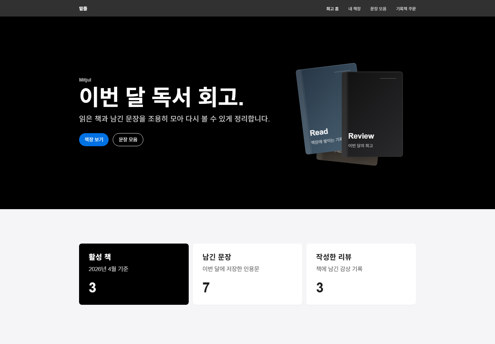
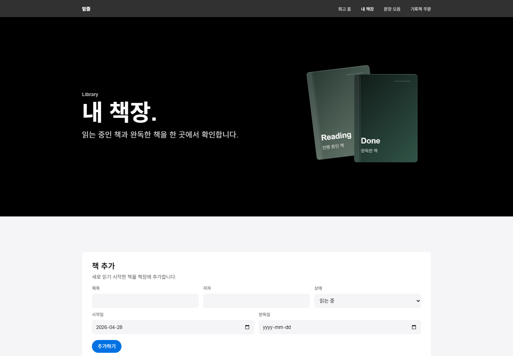
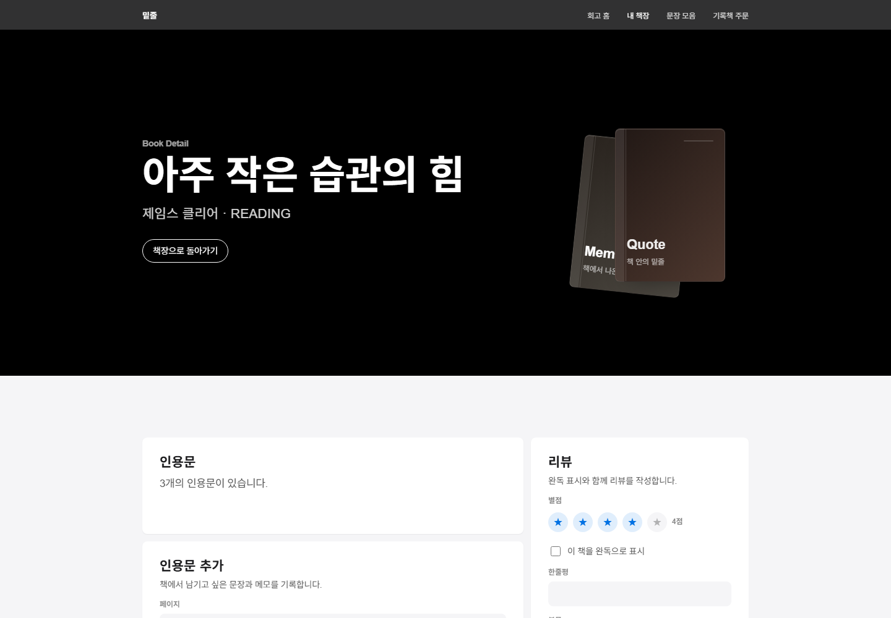
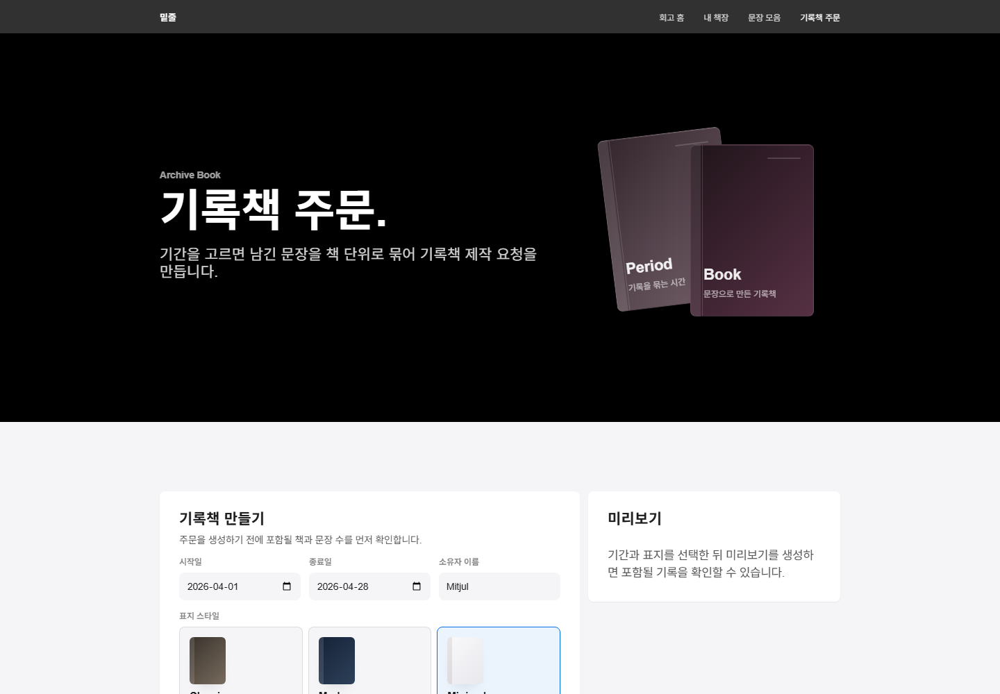
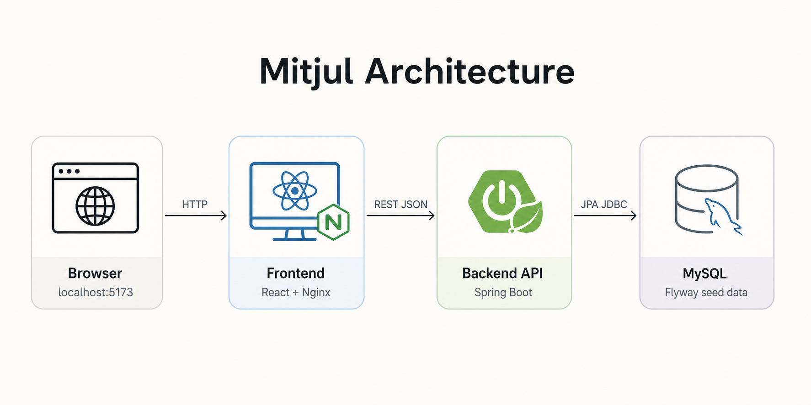

# 밑줄 (Mitjul)

> 책을 읽으며 남긴 인용문과 생각이, 연말에 한 권의 나만의 독서 기록책이 됩니다.

`밑줄(Mitjul)`은 책에서 남긴 문장, 메모, 감정 태그, 리뷰를 모아 다시 볼 수 있게 하는 독서 기록 서비스입니다.  
콘텐츠 서비스가 본체이고, 쌓인 기록을 바탕으로 독서 기록책 주문과 주문 데이터 내보내기로 이어지는 구조를 목표로 했습니다.

## 1. 서비스 소개

### 타겟 사용자

- 책을 읽고 나면 좋았던 문장과 생각이 금방 흩어지는 것을 아쉬워하는 독자
- 책별로 밑줄, 메모, 리뷰를 정리하고 싶은 사용자
- 일정 기간 동안 쌓은 독서 기록을 하나의 기록책 데이터로 묶어 보고 싶은 사용자

### 주요 기능

- 책 등록, 조회, 수정, 삭제
- 책별 인용문 카드 등록, 수정, 삭제
- 감정 태그 기반 인용문 분류
- 책별 리뷰 작성과 수정
- 회고 홈에서 월간 독서 요약, 최근 문장, 최근 리뷰 확인
- 문장 모음에서 키워드와 태그로 인용문 검색
- 독서 기록책 주문 미리보기, 생성, 목록/상세 조회
- 주문 취소와 주문 상태 확인
- 주문 1건에 필요한 콘텐츠와 메타데이터를 JSON으로 내보내기

### 화면 미리보기

| 회고 홈 | 내 책장 |
|---|---|
|  |  |

| 책 상세 | 기록책 주문 |
|---|---|
|  |  |

## 2. 실행 방법 (Docker)

```powershell
# 저장소 클론
git clone https://github.com/k0081915/mitjul.git
cd mitjul

# 환경변수 준비
copy .env.example .env

# 실행
docker compose up --build

# 접속
http://localhost:5173
```


| 항목 | URL |
|---|---|
| Frontend | http://localhost:5173 |
| Backend API | http://localhost:8080 |
| Swagger UI | http://localhost:8080/swagger-ui.html |

Docker Compose는 MySQL, Spring Boot 백엔드, Nginx로 서빙되는 React 프론트엔드를 함께 실행합니다.  
초기 실행 시 Flyway migration이 적용되고, 로그인 없이 확인 가능한 더미 데이터가 자동으로 들어갑니다.

## 3. 포트 변경 방법

기본 포트는 `.env.example` 기준으로 설정되어 있습니다.

```env
DB_ROOT_PASSWORD=password
DB_PORT=3306
BACKEND_PORT=8080
FRONTEND_PORT=5173
VITE_API_BASE_URL=http://localhost:8080
```

로컬에서 MySQL 3306 포트를 이미 사용 중이라면 `.env`에서 아래처럼 바꿔 실행할 수 있습니다.

```env
DB_PORT=3307
```

프론트엔드나 백엔드 포트를 바꿀 경우 `FRONTEND_PORT`, `BACKEND_PORT`, `VITE_API_BASE_URL`도 함께 맞춰 주세요.

## 4. 완성한 레벨

### Lv1. 서비스 구현

독서 기록 서비스의 핵심 플로우를 구현했습니다.

- 책 CRUD
- 인용문 카드 CRUD
- 감정 태그 다중 선택
- 리뷰 작성/수정
- 회고 홈 요약
- 인용문 검색과 태그 필터
- 로그인 없이 바로 확인 가능한 seed 데이터

### Lv2. 자체 주문 기능

사용자가 독서 기록을 기록책 주문으로 묶을 수 있는 기능을 구현했습니다.

- 주문 미리보기
- 주문 생성
- 주문 목록 조회
- 주문 상세 조회
- 주문 상태 관리
- 주문 취소
- 주문 생성 시점의 콘텐츠 snapshot 저장

### Lv3. 주문 데이터 익스포트

가상의 파트너에게 전달할 수 있도록 주문 1건의 데이터를 JSON으로 내보내는 기능을 구현했습니다.

- `GET /api/orders/{id}/export/json`
- 주문번호, 상태, 생성 시각, 내보내기 시각 포함
- 주문 당시 `snapshotJson` 기준으로 책, 인용문, 메모, 페이지, 태그, 작성 시각 포함
- 주문 이후 원본 책이나 인용문이 수정되어도 export 결과는 주문 당시 기록을 유지

## 5. 기술 스택 및 아키텍처

### Frontend

- React 19
- TypeScript
- Vite
- React Router
- TanStack Query
- CSS 기반 커스텀 UI

### Backend

- Java 17
- Spring Boot 3.5.14
- Spring Web
- Spring Data JPA
- Bean Validation
- Flyway
- Springdoc OpenAPI

### Database / Infra

- MySQL 8.0
- Docker Compose
- Nginx
- H2 for test

### 스택 선택 이유

| 선택 | 이유 |
|---|---|
| Java 17 + Spring Boot 3.5.14 | 자바/스프링 경험이 있어 제한된 기간 안에 REST API, 검증, 예외 처리, 테스트를 안정적으로 구성하기 좋다고 판단했습니다. |
| Spring Data JPA + Hibernate | 책, 인용문, 태그, 리뷰, 주문처럼 관계가 있는 도메인을 엔티티 중심으로 표현하기 적합했습니다. |
| MySQL 8.0 | Docker 이미지가 안정적이고, 주문 시점 데이터를 보존하는 `snapshot_json` JSON 컬럼을 사용할 수 있습니다. |
| Flyway | 심사자 환경에서도 동일한 스키마와 seed 데이터를 재현하기 위해 사용했습니다. |
| React 19 + TypeScript + Vite | SSR/SEO가 핵심이 아닌 SPA 과제라 빠른 개발과 가벼운 빌드 구성이 중요했습니다. |
| React Router | 회고 홈, 책장, 문장 모음, 기록책 주문 화면을 URL 단위로 명확히 나누기 위해 사용했습니다. |
| TanStack Query | REST API의 로딩, 에러, 캐싱, mutation 이후 갱신 흐름을 일관되게 관리하기 위해 사용했습니다. |
| CSS 기반 커스텀 UI | Tailwind나 UI 라이브러리 없이 서비스 톤에 맞춘 Apple 스타일 미니멀 UI를 직접 구현했습니다. |
| Docker Compose | MySQL, 백엔드, 프론트엔드를 한 번에 실행해 심사자가 같은 환경에서 바로 확인할 수 있게 했습니다. |

### 아키텍처



## 6. 디렉터리 구조

```text
mitjul/
├── backend/
│   ├── src/main/java/com/mitjul/
│   │   ├── api/          # REST Controller
│   │   ├── common/       # 공통 예외, 에러 응답
│   │   ├── config/       # CORS, OpenAPI, JPA Auditing 설정
│   │   ├── domain/       # JPA Entity, Repository, Enum
│   │   ├── dto/          # Request / Response DTO
│   │   └── service/      # 비즈니스 로직
│   ├── src/main/resources/db/migration/
│   │   ├── V1__init.sql
│   │   ├── V2__seed.sql
│   │   ├── V3__remove_book_isbn.sql
│   │   └── V4__upsert_seed_orders.sql
│   ├── src/test/
│   ├── build.gradle
│   └── Dockerfile
├── frontend/
│   ├── src/
│   │   ├── api/          # API client, React Query hooks
│   │   ├── assets/       # 정적 에셋
│   │   ├── pages/        # 화면 컴포넌트
│   │   ├── routes/       # React Router 설정
│   │   ├── types/        # API 타입
│   │   └── utils/        # 공통 유틸
│   ├── package.json
│   └── Dockerfile
├── docs/
│   └── architecture.png
├── scripts/
│   ├── verify-backend-lv1.ps1
│   ├── verify-backend-lv2.ps1
│   └── verify-backend-lv3.ps1
├── docker-compose.yml
├── .env.example
└── README.md
```

## 7. 주요 화면 / 라우트

| 경로 | 화면 | 설명 |
|---|---|---|
| `/` | 회고 홈 | 월간 독서 요약, 최근 문장, 최근 리뷰 |
| `/books` | 내 책장 | 책 목록, 책 추가, 수정, 삭제 |
| `/books/:bookId` | 책 상세 | 책별 인용문, 리뷰, 인용문 추가/수정/삭제 |
| `/quotes` | 문장 모음 | 전체 인용문 검색, 태그 필터 |
| `/orders` | 기록책 주문 | 주문 미리보기, 주문 생성, 주문 목록 |
| `/orders/:orderId` | 주문 상세 | 주문 정보, 포함 책 목록, JSON 다운로드, 주문 취소 |

## 8. API 요약

| 구분 | 메서드/경로 | 설명 |
|---|---|---|
| Books | `GET /api/books` | 책 목록 조회 |
| Books | `POST /api/books` | 책 등록 |
| Books | `GET /api/books/{id}` | 책 상세 조회 |
| Books | `PATCH /api/books/{id}` | 책 수정 |
| Books | `DELETE /api/books/{id}` | 책 삭제 |
| Quotes | `GET /api/books/{bookId}/quotes` | 책별 인용문 조회 |
| Quotes | `POST /api/books/{bookId}/quotes` | 인용문 등록 |
| Quotes | `PATCH /api/quotes/{id}` | 인용문 수정 |
| Quotes | `DELETE /api/quotes/{id}` | 인용문 삭제 |
| Quotes | `GET /api/quotes/search` | 키워드/태그 기반 인용문 검색 |
| Reviews | `GET /api/books/{bookId}/review` | 책 리뷰 조회 |
| Reviews | `PUT /api/books/{bookId}/review` | 리뷰 생성 또는 수정 |
| Tags | `GET /api/tags` | 태그 목록 조회 |
| Dashboard | `GET /api/dashboard/summary` | 회고 홈 요약 조회 |
| Orders | `POST /api/orders/preview` | 주문 미리보기 |
| Orders | `POST /api/orders` | 주문 생성 |
| Orders | `GET /api/orders` | 주문 목록 조회 |
| Orders | `GET /api/orders/{id}` | 주문 상세 조회 |
| Orders | `PATCH /api/orders/{id}/status` | 주문 상태 변경 |
| Export | `GET /api/orders/{id}/export/json` | 주문 JSON 내보내기 |

## 9. 더미 데이터

Docker 실행 직후 로그인 없이 서비스를 확인할 수 있도록 Flyway seed 데이터를 포함했습니다.

- 사용자 1명: `김독서`
- 책 데이터
- 인용문과 메모
- 감정 태그 8개
- 리뷰 데이터
- 기록책 주문 seed 데이터
  - 완료
  - 대기
  - 제작 중
  - 취소

## 10. AI 도구 사용 내역

이번 과제에서는 AI를 기획 보조와 구현 보조로 나누어 사용했습니다.

| AI 도구 | 활용 영역 |
|---|---|
| Claude Code | 주제 선정, 서비스 구조 설계, 데이터 모델링, API 설계 초안 |
| Codex | Spring Boot/React 구현, Docker 구성, 시드 데이터와 README 정리 |
| Gemini | 코드 리뷰 |

실제 개발 과정에서는 Codex로 구현 초안을 빠르게 만들고 테스트와 Docker 실행, 브라우저 확인으로 검증했습니다.  
프론트 UI가 처음에는 밋밋하게 나와 `gpt-taste` skill을 참고해 히어로, 책 오브젝트, 카드 배치의 방향을 다시 잡았습니다.  
AI 결과는 그대로 채택하지 않고 PR 리뷰 관점에서 다시 확인한 뒤 N+1 문제, 주문번호 동시성 문제, 날짜 처리 문제, Flyway seed migration 방식 등을 수정했습니다.

## 11. 설계 의도

이 서비스 아이디어는 책을 다 읽고도 인상 깊었던 문장과 생각이 시간이 지나면 금방 흩어진다는 문제의식에서 출발했습니다.  
독서 앱을 새로 만든다기보다 독자가 책을 읽는 동안 남긴 밑줄과 메모를 나중에 다시 꺼내 볼 수 있는 개인 아카이브로 만들고 싶었습니다.

그래서 기록의 중심을 "책 한 권"이 아니라 사용자가 직접 고른 "문장과 생각"에 두었습니다.  
책은 기록을 묶는 기준이고 인용문, 감정 태그, 메모, 리뷰는 사용자의 독서 경험을 더 구체적으로 남기는 단위입니다.  
이렇게 쌓인 기록이 월간 회고와 기록책 주문으로 자연스럽게 이어지도록 설계했습니다.

사업적으로는 독서 인구 전체를 넓게 잡기보다 책을 꾸준히 읽고 자신의 문장과 기록을 소장하고 싶어 하는 사용자에게 집중할 수 있다고 보았습니다.  
독서 기록은 단순 데이터보다 개인의 취향과 시간이 쌓인 콘텐츠에 가깝기 때문에 월간/연간 기록책, 독서모임 아카이브, 선물용 독서 회고집처럼 개인화된 출력 상품으로 확장할 여지가 있습니다.  
특히 사용자가 직접 고른 인용문과 메모를 기반으로 하기 때문에 일반 포토북보다 개인화 정도가 높고, 프리미엄 기록 상품으로 과금 가능성이 있다고 판단했습니다.

## 12. 더 시간이 있었다면

- OCR로 종이책 페이지를 촬영해 인용문 자동 추출
- AI 감정 태그 자동 추천
- 독서모임 공유 컬렉션
- 실제 표지 이미지 업로드 또는 AI 표지 생성
- OAuth 로그인과 사용자별 데이터 분리
- JSON export 외 ZIP 패키징 옵션
